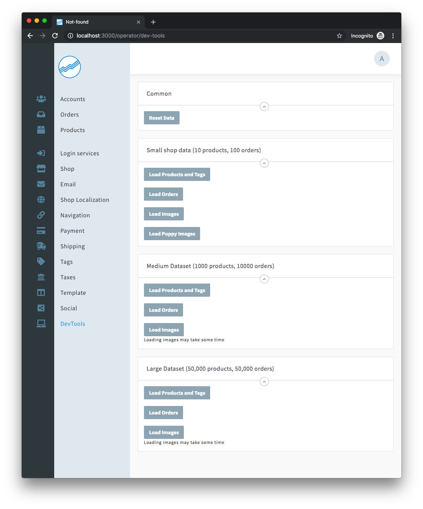

# ⚠️ THIS PLUGIN IS DEPRECATED — Use with Reaction Commerce 2.0 to 2.9.1 only

This is an old devtools plugin made for Reaction Commerce 2.x. If you're looking for a similar devtools plugin for Reaction Commerce 3.0 onwards, check out [`@outgrowio/reaction-dummy-data`](https://github.com/outgrow/reaction-dummy-data).

# reaction-devtools

This is a plugin that creates a new dashboard panel that allows you to load datasets for testing

You have a choice of three different datasets and optionally attach random images:

1. Small - 7 products (+ variants and options), 100 orders
1. Medium - 1000 products (+ variants and options), 10,000 orders
1. Large - 50,000 products (+ variants and options), 50,000 orders

**Note** Loading the "Large" dataset on a local dev box is discouraged

### To install

1. Clone this repo into `/imports/plugins/custom/`
1. `meteor npm install jpeg-js` (for random image generation)
1. `reaction reset`

### Usage

1. Browse to `http://localhost:3000`
1. Login
1. Click on DevTools (note this is only visible when running in development mode)
1. 
1. Click the buttons to trigger an action
